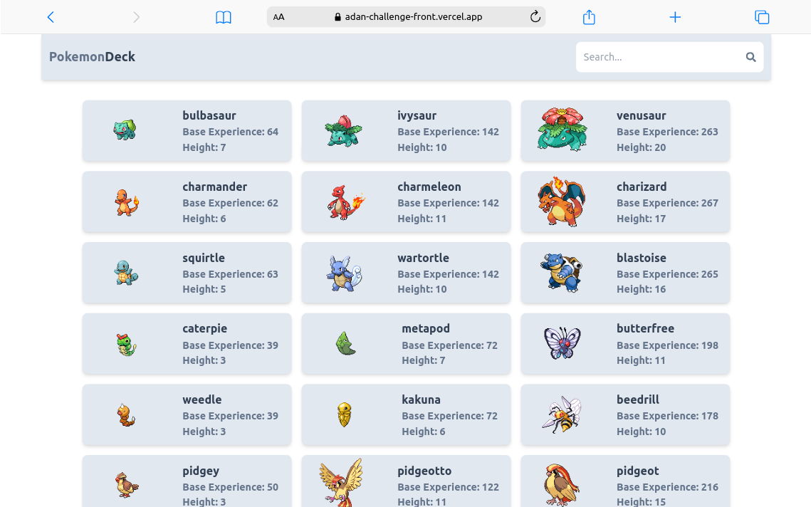

# Pokemon Deck




## 💻 Prerequisites

Before you begin, ensure you have met the following requirements:

- You have installed the latest version of `React & Tailwind`.
- You have a `<Windows || Linux || Mac>` machine.

## 🚀 Getting Started

This is an example of how you may give instructions on setting up your project locally.
To get a local copy up and running follow these simple example steps.

### Cloning the Project

To clone the Pokemon Deck, follow these steps:

Linux, macOS or Windows:

```
git clone https://github.com/Aleikson/adan-challenge-front.git
```

### Installing the dependencies

To install the dependencies, follow these steps:

```
npm install
```

```
npm run dev
```

### Built With

This project was made with these technologies.

 


## Contact

Aleikson Silva - [LinkedIn](https://www.linkedin.com/in/aleikson-frontend/)

Project Link: - [Website Link](https://adan-challenge-front.vercel.app/)

<p align="right">(<a href="#readme-top">back to top</a>)</p>
